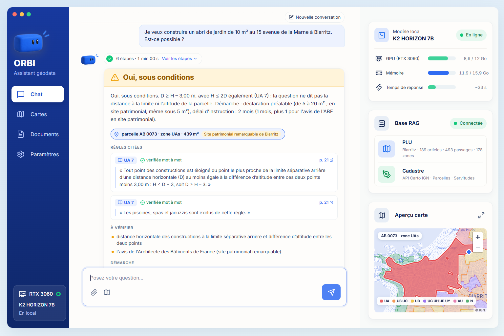
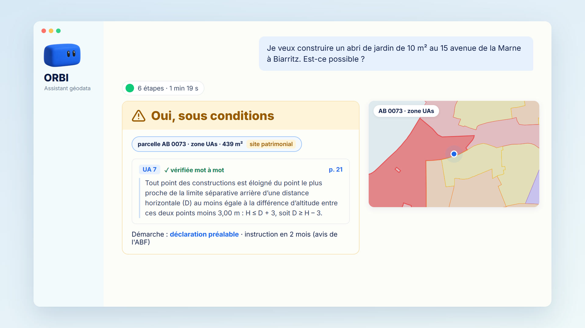
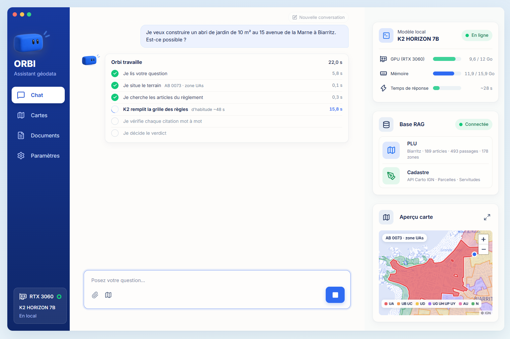
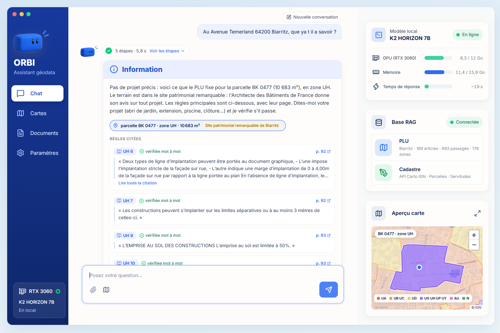
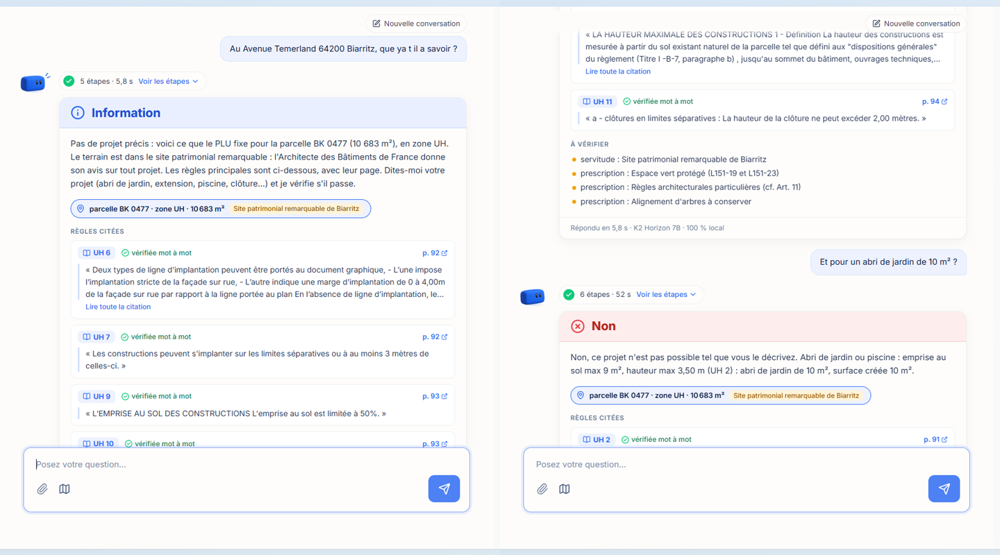
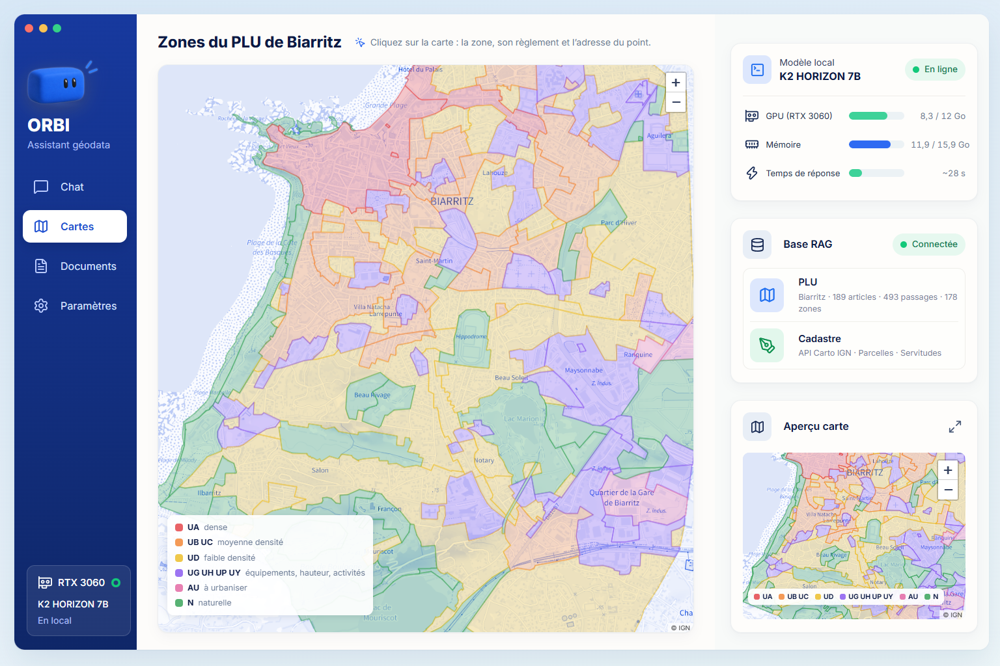
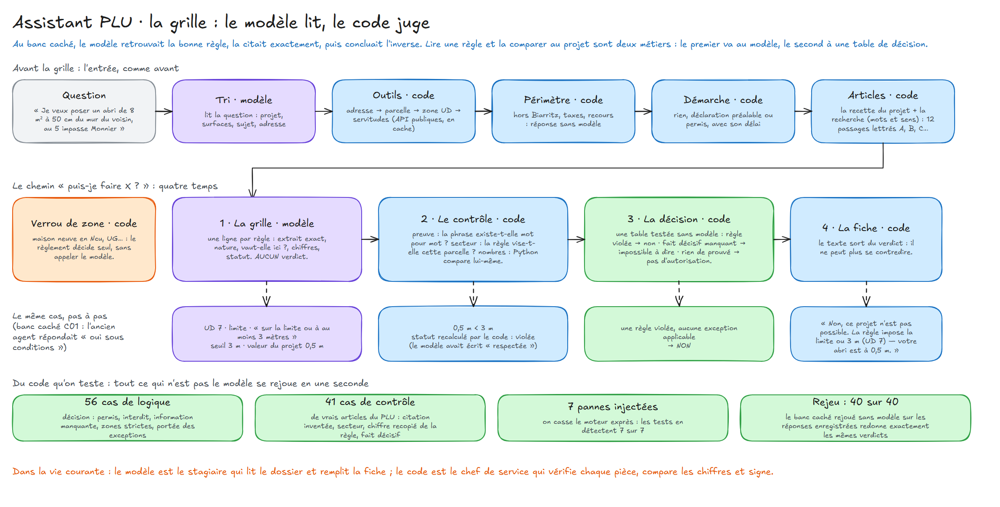
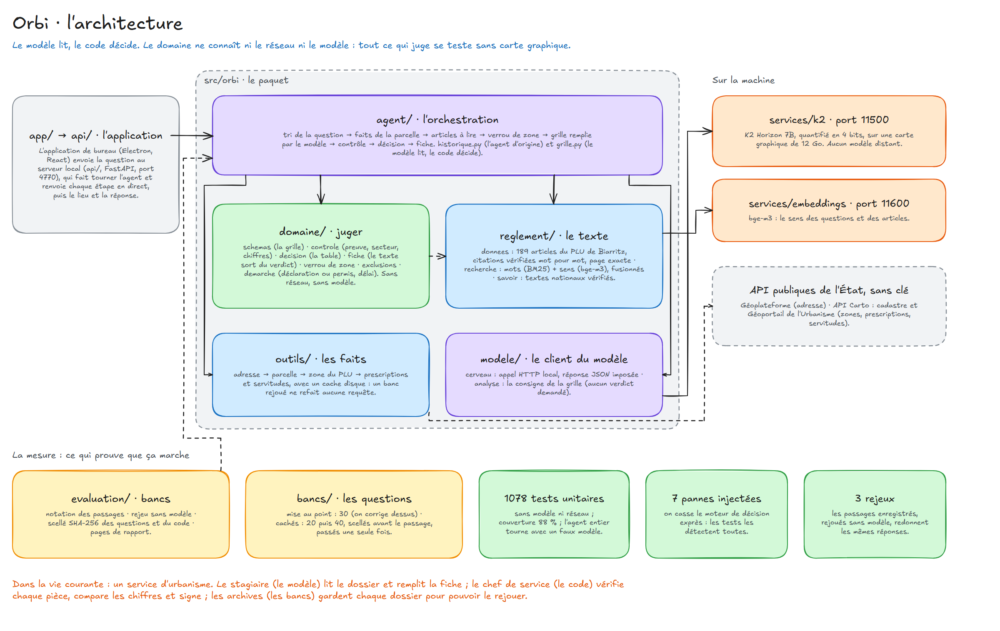

# Orbi

**L'assistant d'urbanisme qui lit le PLU de Biarritz sur votre ordinateur.** Vous donnez une adresse et un projet ;
Orbi répond *oui*, *non* ou *sous conditions*, cite la phrase exacte du règlement avec sa page, et donne la démarche
(déclaration préalable ou permis) avec son délai. Le modèle de langage tourne en local, sur une carte graphique de 12 Go.



> « Je veux construire un abri de jardin de 10 m² au 15 avenue de la Marne à Biarritz. Est-ce possible ? »
> → parcelle AB 0073, zone UAs, site patrimonial remarquable → **oui, sous conditions**, avec l'article UA 7 cité mot
> à mot (page 21), les points à vérifier et la démarche. En une minute, sur une RTX 3060.

[](brag-output/brag.mp4)
*Le film de présentation, 18 secondes : cliquer sur l'image.*

## Ce que fait l'application

| | |
|---|---|
|  | **Une vraie application de bureau** (Electron). À l'ouverture, elle démarre seule le serveur, la recherche et le modèle, et les arrête en se fermant. La colonne de droite montre la vraie machine : carte graphique, mémoire, temps de réponse mesuré. |
|  | **On voit Orbi travailler.** Une analyse prend environ une minute : les six étapes se cochent en direct (lire la question, situer le terrain, chercher les articles, remplir la grille, vérifier chaque citation, décider). |
|  | **Sans projet, la fiche du terrain.** « Que faut-il savoir sur cette adresse ? » : la zone, les servitudes, et une phrase exacte du règlement par thème (recul, voisins, emprise, hauteur, clôtures), composées par le code en quelques secondes. |
|  | **Une conversation, pas un formulaire.** Une relance (« et pour un abri de 10 m² ? ») garde l'adresse de la question précédente ; un « merci » reçoit une réponse d'Orbi, qui ne se répète pas. |
|  | **La carte des zones du PLU**, sur un fond IGN aux couleurs d'Orbi : un clic donne la zone, son règlement et l'adresse du point. Le règlement complet se lit dans l'onglet Documents. |

Sans moteur local (sur une page web, par exemple), l'interface rejoue huit vraies réponses enregistrées.

## Le principe : le modèle lit, le code décide

Un petit modèle de langage se trompe ; on ne lui confie donc pas le verdict. K2 Horizon 7B remplit une **grille** : une
ligne par règle du règlement, avec la phrase exacte, ce qu'elle exige et les chiffres du projet. Puis le code reprend
la main :

1. chaque citation est **vérifiée mot à mot** dans le règlement (sinon la ligne ne compte ni pour ni contre) ;
2. il vérifie que la règle vise bien cette parcelle (zone, secteur, type de projet) ;
3. il **compare lui-même les chiffres** (distances, hauteurs, emprises) ;
4. une **table de décision**, testée sans modèle, tire le verdict ;
5. le texte de la réponse est composé à partir du verdict : il ne peut pas le contredire.



## Des chiffres honnêtes

Un agent ne se juge que sur des questions qu'il n'a jamais vues. Les bancs cachés sont écrits, étiquetés et **scellés
par une empreinte SHA-256** (questions et code) avant le passage, puis passés une seule fois.

| banc | questions | réponses justes |
|---|---|---|
| mise au point (sert à corriger, donc flatteur) | 30 | 25 |
| 1er banc caché | 20 | 12 (ancien agent) |
| 2e banc caché (2 octobre 2026) | 40 | **27** |

Sur le 2e banc caché, 6 réponses sont à contresens. La suite (`labo/vitesse/PLAN-v4.md`) : comparer tous les chiffres
dans le code, filtrer les règles hors sujet, une recette par type de projet, puis un 3e banc caché pour mesurer.

## La qualité

- **1 126 tests** côté Python (unitaires et de mutation : on casse le moteur de décision exprès pour vérifier que les
  tests le voient), 88 % du code couvert, quelques secondes, sans modèle ni réseau ;
- **3 rejeux d'intégration** : les passages enregistrés des bancs, rejoués sans le modèle, doivent redonner exactement
  les mêmes réponses ;
- **76 tests** de l'interface (Vitest) ;
- les défauts connus sont écrits comme des tests marqués `xfail`, avec leur explication.



## La technique

| | |
|---|---|
| Modèle | K2 Horizon 7B en local (Transformers, 4 bits), bge-m3 pour la recherche par le sens |
| Agent | Python : recherche hybride (BM25 + embeddings), grille, contrôle, table de décision |
| Données | règlement du PLU de Biarritz découpé et indexé ; API publiques sans clé (Géoplateforme, API Carto IGN, Géoportail de l'Urbanisme) |
| Serveur | FastAPI, réponses en direct (Server-Sent Events) |
| Application | Electron, React, TypeScript, Vite, Leaflet ; Vitest et Testing Library |
| Mesure | bancs scellés SHA-256, rejeu des traces, tests de mutation |

## Lancer

Prérequis : Python 3.12 et [uv](https://docs.astral.sh/uv/), Node 22, une carte graphique de 12 Go pour le modèle.

```bash
uv sync --group dev                         # le paquet orbi et les outils de test
uv run pytest                               # les tests (sans modèle, quelques secondes)
uv run pytest -m integration                # le rejeu des traces enregistrées (serveur d'embeddings requis)
node scripts/installer-app.mjs              # les dépendances de l'application
cd app && npm run dev                       # l'application : elle démarre le serveur, la recherche et le modèle
cd app && npm test                          # les tests de l'interface
cd app && npm run build:web                 # le site de démonstration (réponses enregistrées)
```

Le modèle et la recherche se lancent depuis `services/k2` et `services/embeddings`. Si une machine les fait tourner
ailleurs, copier `services.exemple.json` en `services.local.json` (hors dépôt) et y indiquer leurs dossiers.
Journaux : `conversations/journaux/`. Le serveur seul : `uv run orbi-serveur` (http://127.0.0.1:4770, API : `/api/docs`).

## L'organisation

```
orbi/
├─ app/               l'application de bureau : Electron (electron/), l'interface React (src/), ses tests (tests/)
├─ src/orbi/
│  ├─ domaine/        la grille, le contrôle, la décision, la fiche, la fiche du terrain, le verrou de zone, la démarche
│  ├─ reglement/      le règlement découpé, les citations exactes, la recherche (mots + sens), le savoir métier
│  ├─ outils/         les API publiques (adresse, cadastre, Géoportail de l'Urbanisme), avec cache disque
│  ├─ modele/         le client du modèle local et ses consignes
│  ├─ agent/          l'orchestration : l'agent historique et la grille
│  ├─ api/            le serveur de l'application : état de la machine, réponses en direct, conversation
│  └─ evaluation/     la notation des bancs, le rejeu sans modèle, le scellé, les pages de rapport
├─ tests/             unitaires, mutations, intégration
├─ bancs/             les questions (jeux/), leurs générateurs, les passages et leurs traces (resultats/)
├─ donnees/           le règlement, l'index de recherche, les zones du PLU, le cache des API
├─ services/          le serveur du modèle (k2/) et le serveur d'embeddings (embeddings/)
├─ docs/              les schémas Excalidraw, les captures, les décisions d'architecture
├─ brag-output/       le film de présentation et ses sources (rendu image par image, bande-son)
└─ labo/              les expériences en cours
```

## Feuille de route

1. **Fondations** : dossiers, tests, documentation *(fait)*
2. **L'application** : Electron, réponses en direct, carte, conversation, fiche du terrain *(fait)*
3. **Fiabilité** : chiffres comparés par le code, filtres d'applicabilité, recettes par projet, 3e banc caché *(suivant)*
4. **Vitesse** : moins d'une minute par analyse
5. **La faisabilité** : plusieurs parcelles, ce qu'on peut y construire, comparé, avec un plan
6. **Apprendre des retours** : les avis des utilisateurs, relus, deviennent des cas de test puis des règles
